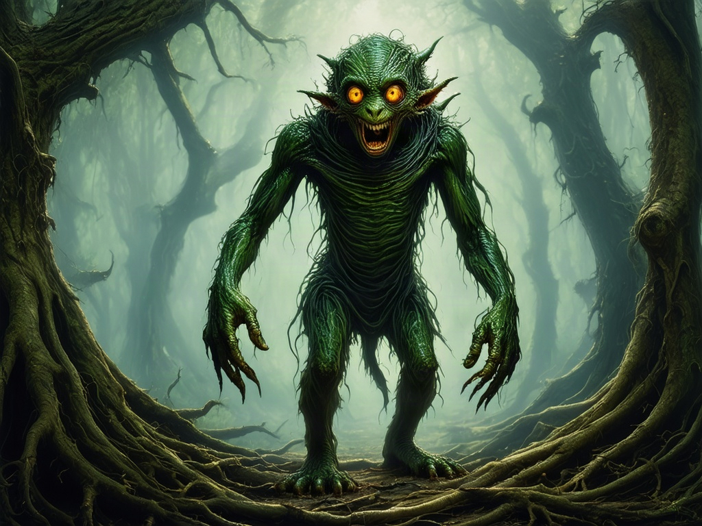

# A Knight's Adventure

A Rock-Paper-Scissors adventure game built with React + Vite. Face five villains in sequence — win each round to press onward, lose once and the adventure ends.

This is a browser port of an [original Python CLI version](https://github.com/jcsmileyjr/python-practice/tree/main/knight_adventure) of the same game.

**Play it live:** https://jcsmileyjr.github.io/knightadventure/

## Screenshot



## How to play

1. Enter your name to begin.
2. Each of the five villains — goblin, frost knight, giant spider, cursed wight, and dragon — challenges you to Rock, Paper, or Scissors.
3. Win the round to advance to the next villain. A tie just replays the round.
4. Lose a single round and the adventure ends in defeat.
5. Beat all five to win the game.

## Tech stack

- [React 19](https://react.dev/)
- [Vite](https://vite.dev/)
- Plain CSS (no UI framework)
- Deployed to GitHub Pages via [`gh-pages`](https://www.npmjs.com/package/gh-pages)

## Getting started

```bash
git clone https://github.com/jcsmileyjr/knightadventure.git
cd knightadventure
npm install
npm run dev
```

The dev server runs at `http://localhost:5173`.

## Available scripts

| Script | Description |
| --- | --- |
| `npm run dev` | Start the local dev server with hot reload |
| `npm run build` | Build the production bundle to `dist/` |
| `npm run preview` | Preview the production build locally |
| `npm run lint` | Run Oxlint |
| `npm run deploy` | Build and publish `dist/` to GitHub Pages |

## Adding or replacing villain art

Drop an image into `public/images/` named to match the villain's `image` path in `src/data/villains.js`, for example `goblin.jpg` or `dragon.png`. Any common web image format works.

- Recommended size: roughly **1200×900px** (4:3) or **1200×675px** (16:9) — sharp on both mobile and desktop layouts.
- Images are cropped to fill their frame (`object-fit: cover`), so keep the villain centered in the shot.
- A missing image falls back to a placeholder frame automatically, so the game still plays fine before art is ready.

## Credits

Story and game design originally written by JC Smiley as a Python CLI exercise, ported to React for the web.
